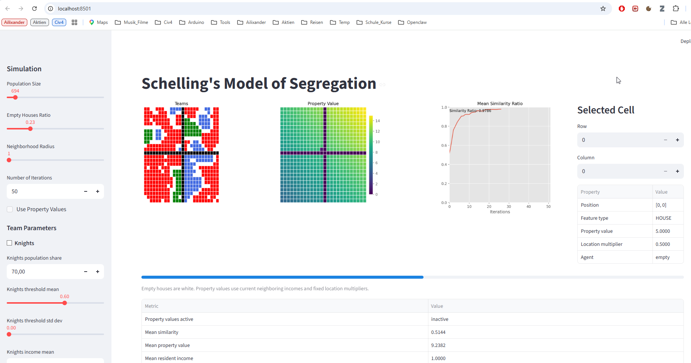

# schelling-mod

Modified version of Schelling's segregation simulator with a Streamlit frontend and additional economic dynamics.



## Overview

This project extends a Schelling-style segregation model with:

- per-group similarity-threshold distributions
- pairwise cultural distance between groups
- per-group income distributions
- property values derived from neighborhood income
- affordability-constrained movement
- a cross-shaped street layout that partitions the city into four blocks

The frontend shows:

- a teams map
- a property-value map
- a mean-similarity chart
- detailed information for a selected cell

## Credits

This project is based on the Streamlit Schelling simulator from
https://github.com/adilmoujahid/streamlit-schelling.

Thanks to Adil Moujahid. Blog: https://adilmoujahid.com/.

## Python Version

This project targets Python `3.14`.

## Project Structure

```text
schelling-mod/
├── doc/
│   └── images/
│       └── Overview.png
├── schelling_mod/
│   ├── __init__.py
│   ├── agent.py
│   ├── app.py
│   ├── city.py
│   ├── feature.py
│   └── utils.py
├── environment.yml
├── main.py
├── pyproject.toml
├── README.md
└── requirements.txt
```

- `schelling_mod/` contains the simulation and UI code.
- `main.py` is the main entry point for Streamlit and CLI use.
- `environment.yml` defines the conda environment.
- `requirements.txt` contains direct Python dependencies.

## Installation

### Option 1: Conda recommended

The repository is configured for a conda environment named `schelling311`.

Create or update the environment:

```powershell
conda env update -f environment.yml --prune
```

Activate it:

```powershell
conda activate schelling311
```

Optional editable install:

```powershell
python -m pip install -e .
```

Use the editable install if you want the package metadata registered in the environment while continuing to work on the
local source tree.

### Option 2: Pip only

If you do not want to use conda:

```powershell
python -m pip install -r requirements.txt
python -m pip install -e .
```

## How To Run

### Run the Streamlit frontend

```powershell
conda activate schelling311
streamlit run main.py
```

Streamlit will print a local URL, usually `http://localhost:8501`, and open the interface in your browser.

### Run the command-line simulation

```powershell
conda activate schelling311
python main.py --run_simulation
```

Optional CLI arguments:

- `--population_size`
- `--empty_ratio`
- `--threshold_std_dev`
- `--iterations`

Example:

```powershell
conda activate schelling311
python main.py --run_simulation --population_size 2500 --empty_ratio 0.2 --threshold_std_dev 0.05 --iterations 10
```

The simulation stops early in both CLI and Streamlit mode if all agents are satisfied before the configured iteration
limit is reached.

## How To Use The Frontend

### Main workflow

1. Start the app with `streamlit run main.py`.
2. Adjust parameters in the left sidebar.
3. Press `Run Simulation`.
4. Inspect the updated maps, chart, summary table, and selected-cell details.

### What the frontend shows

- `Teams`: occupancy map of groups and empty houses. Streets are shown in black.
- `Property Value`: house-value heatmap based on neighboring incomes and fixed location multipliers.
- `Mean Similarity Ratio`: chart of the aggregate similarity measure over simulation iterations.
- `Selected Cell`: detailed view for one map cell, including type, value, location multiplier, and agent information.
- `Metrics Table`: current summary values such as mean similarity, mean property value, and mean resident income.

### How to inspect one location

Use the `Row` and `Column` controls in `Selected Cell` to inspect a specific map position. The table shows:

- position
- feature type
- property value
- location multiplier
- agent team, if occupied
- last action, if the simulation has been run
- similarity threshold
- income

## Frontend Parameters

The sidebar is the main control surface. The app loads initial values from `schelling_streamlit_config.json` if that
file exists. During normal interaction, the active settings live in Streamlit session state.

### Simulation section

#### `Population Size`

- Type: slider
- Range: `9` to `10000`
- Meaning: requested number of cells before the square grid is built
- Important detail: the model uses a square map, so the requested value is reduced to the nearest lower perfect square

Examples:

- `100` creates a `10 x 10` map
- `90` creates an `9 x 9` map because `sqrt(90)` is truncated to `9`

#### `Empty Houses Ratio`

- Type: slider
- Range: `0.0` to `1.0`
- Meaning: fraction of house cells initialized without an agent
- Higher value: more empty housing, more available movement destinations
- Lower value: denser occupancy, fewer relocation options

This ratio applies to house cells, not to street cells. Street cells are fixed barriers.

#### `Neighborhood Radius`

- Type: slider
- Range: `1` to `5`
- Meaning: radius used when computing neighborhood similarity

Interpretation:

- `1` means the immediate Moore neighborhood around a cell
- larger values expand the square search area

Higher values make each agent evaluate a broader local environment instead of only nearby adjacent cells.

#### `Number of Iterations`

- Type: integer input
- Minimum: `1`
- Meaning: maximum number of simulation steps to run when `Run Simulation` is pressed

Important detail:

- the simulation may stop earlier if everybody is satisfied

#### `Use Property Values`

- Type: checkbox
- Meaning: enables the economic housing constraint

When enabled:

- houses have calculated property values
- an agent must move if it cannot afford its current house
- an agent may only move to an affordable empty house

When disabled:

- property values are still displayed, but affordability is not used to force or restrict movement
- movement decisions are based only on social similarity

### Team Parameters section

Each group has its own parameter block. The current groups are:

- `Knights`
- `Elves`
- `Orcs`

For each group, the following parameters can be set.

#### `<Group> population share`

- Type: numeric input
- Range: `0.0` to `100.0`
- Meaning: relative share of occupied houses assigned to that group during initialization

Important detail:

- the entered shares are normalized internally, so they do not have to sum to exactly `100`

Example:

- `70`, `20`, `10` produces a `70% / 20% / 10%` split
- `7`, `2`, `1` produces the same normalized split

#### `<Group> threshold mean`

- Type: slider
- Range: `0.0` to `1.0`
- Meaning: mean of the similarity-threshold distribution for that group

Interpretation:

- higher values make the group more selective
- lower values make the group easier to satisfy socially

#### `<Group> threshold std dev`

- Type: slider
- Range: `0.0` to `0.5`
- Meaning: standard deviation of the similarity-threshold distribution for that group

Interpretation:

- `0.0` means all agents in that group receive the same threshold
- larger values create more within-group variation in tolerance

#### `<Group> income mean`

- Type: numeric input
- Minimum: `0.0`
- Meaning: mean of the income distribution for that group

Interpretation:

- higher values make members of the group able to afford more expensive houses
- lower values reduce the affordability ceiling

#### `<Group> income std dev`

- Type: numeric input
- Minimum: `0.0`
- Meaning: standard deviation of the income distribution for that group

Interpretation:

- `0.0` gives the group a uniform income
- larger values create within-group economic diversity

### Cultural Distance section

Each pair of groups has one cultural-distance parameter.

#### `<Group A> - <Group B>`

- Type: slider
- Range: `0.0` to `5.0`
- Meaning: pairwise cultural distance between two groups

Interpretation:

- lower values mean the two groups are treated as more similar
- higher values mean they are treated as more different

The implemented cultural similarity is:

```text
similarity = max(0, 1 - distance)
```

So:

- distance `0.0` means full cultural similarity
- distance `1.0` means zero cultural similarity
- values above `1.0` are clamped effectively to zero similarity

## Simulation Behavior

The current model includes:

- social similarity based on group-to-group cultural distance
- optional economic pressure through house affordability
- cross-shaped streets that permanently divide the city into four blocks
- movement based on sampling `10` random cells and choosing the best valid destination

When an agent must move:

- it samples `10` random cells
- only empty houses are considered
- if property values are active, only affordable empty houses are considered
- the best sampled destination is chosen by expected neighborhood similarity

## Requirements File Or YAML

If you are using conda, `environment.yml` should be treated as the primary environment file because it defines the
Python version and the installation path in one place.

Practical recommendation:

- use `environment.yml` for environment creation
- keep `requirements.txt` for direct pip dependencies

## Literature

To read: https://www.sciencedirect.com/science/article/pii/S0264275124000520
